<div align="center">

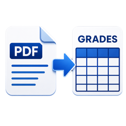

# Advisee Document Filler

A small tool for UNP CCIT advisers that turns Periodic Grades Listing PDFs
into filled Appraisal Sheets and Reports of Rating - as a standalone
desktop app or a local web app.

[](LICENSE)
[]()
[](#verifying-a-release-sigstore)

</div>

---

## About

Every term, CCIT advisers have to turn the registrar's Periodic Grades
Listing PDF into two official forms, by hand, for every advisee:

- **Appraisal Sheet** (VPAA-CCIT-QF-05) - one per student, all terms in
  one file, using the template that matches the student's course (BSCS,
  BSIT, BLIS or DCT), auto-detected from the PDF.
- **Report of Rating** (VPAA-CCIT-QF-09) - one per student per term.

Advisee Document Filler reads the grade listing PDFs, matches students
across terms, and generates both documents automatically.

## Motivation

Filling these forms by hand is repetitive, error-prone, and doesn't scale
past a handful of advisees. This tool exists so an adviser can point it at
the PDFs the SIAS already provides and get correctly formatted,
ready-to-print documents back in a few clicks - no copy-pasting names and
grades between spreadsheets and Word templates.

## Features

- ✓ Parses the registrar's Periodic Grades Listing PDF directly - no manual data entry
- ✓ Auto-detects course (BSCS, BSIT, BLIS, DCT) and picks the matching template
- ✓ Matches students across multiple term PDFs by ID number
- ✓ Fills Appraisal Sheets and Reports of Rating, with unused rows trimmed automatically
- ✓ Individual docx per student, or one merged batch file for bulk printing
- ✓ Remembers Adviser, Dean, and per-subject faculty names locally for next time
- ✓ Runs as a desktop wizard (no browser) or a loopback-only local web app
- ✓ Light/dark theme, resizable text, native look on Windows and Linux
- ✓ Signed, verifiable releases built entirely on GitHub's runners

## How It Works

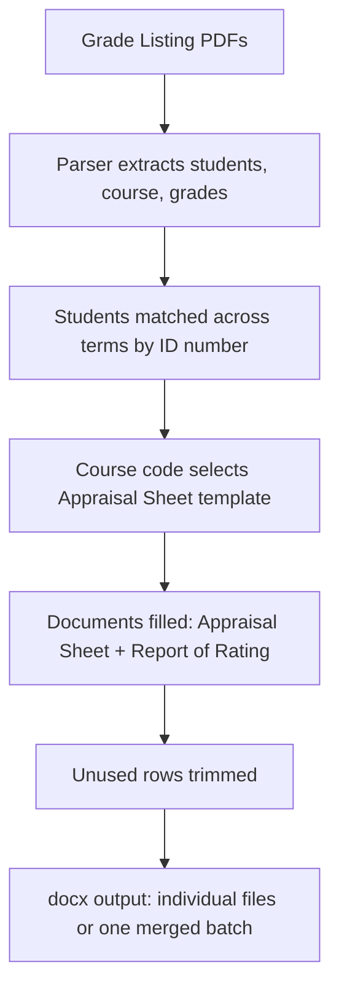

1. One or more grade listing PDFs are added, along with the Adviser and Dean names.
2. The parser reads each PDF, matching students by ID number across terms.
3. The course found in each PDF picks the matching Appraisal Sheet template.
4. Both documents are filled and blank rows are trimmed automatically.
5. Output is generated as individual docx files or one merged batch file.

## Architecture

**Language:** Python 3

**Libraries:** Flask · pdfplumber · python-docx · docxcompose · darkdetect

**Packaging:** PyInstaller (onedir builds), Inno Setup (Windows installer),
deb/rpm/pkg (Linux), GitHub Actions, Sigstore/cosign

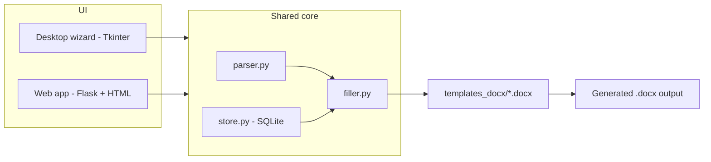

Both the desktop app and the web app are thin UIs over the same parsing
and filling logic, so behavior stays identical between the two.

## Project Structure

```
appraisal-filler/
├── app.py               # Flask web app
├── gui_app.py            # Tkinter desktop wizard
├── parser.py              # Periodic Grades Listing PDF parser
├── filler.py               # Fills the docx templates
├── store.py                # Local SQLite store for remembered names
├── version.py               # Resolves the running build's version
├── templates_docx/           # Appraisal Sheet / Report of Rating .docx templates
├── templates/                # Web app HTML
├── static/                    # Web app assets (favicon, etc.)
├── assets/                     # App icon / logo
├── signing/                     # Windows publisher certificate
├── build_windows.bat             # Local Windows PyInstaller build
├── build_linux.sh                 # Local Linux PyInstaller build
├── installer.iss                   # Inno Setup script for the Windows installer
└── .github/workflows/                # CI: builds executables and Linux packages
```

## Installation

### A. Standalone desktop app (recommended, no browser)

A step-by-step wizard, with no web server, no network, nothing exposed.

From source:

```
pip install -r requirements.txt
python gui_app.py
```

Tkinter is required once on Linux: `sudo apt install python3-tk`

Also available as a single-file executable, with no Python needed on the
target machine:

- Windows: `build_windows.bat` produces `dist\AdviseeDocFiller.exe`
- Linux: `build_linux.sh` produces `dist/AdviseeDocFiller`

Each is built on the OS it targets - PyInstaller does not cross-compile,
so the Windows exe is built on Windows and the Linux binary on Linux. A
Linux binary runs on distros with the same or newer glibc than the
build machine.

Generated documents default to an `AdviseeDocuments` folder inside the
real Documents folder (`Documents\AdviseeDocuments` on Windows, resolved
even if OneDrive or a domain policy has redirected it;
`~/Documents/AdviseeDocuments` on Linux, following the XDG user-dirs
setting). The output location can be changed via "Browse..." on the
Generate step.

### B. Web app (optional)

```
pip install -r requirements.txt
python app.py
```

It binds to 127.0.0.1 only (loopback, not visible to the network) and
picks a free port in the dynamic private range (49152-65535), with the
exact address printed on start.

### Prebuilt releases

**Windows**, two options from the same build:

1. Installer: `AdviseeDocFiller-Setup-1.0.exe` installs to
   `C:\Program Files\Yaksharo Solutions\Advisee Document Filler`, adds a
   Start Menu entry (and optional desktop icon), and registers a normal
   uninstaller in Windows Settings.
2. Portable: `AdviseeDocFiller-windows-portable.zip` extracts once
   anywhere (USB stick included), with `AdviseeDocFiller.exe` runnable
   directly inside. The folder can be copy-pasted to move it, as long as
   the exe stays next to its `_internal` folder.

**Linux portable:** `AdviseeDocFiller-linux.tar.gz` extracts and runs.

**Linux packages** (built for the three big families, attached to Releases):

- Debian / Ubuntu / Mint: `sudo apt install ./adviseedocfiller_*.deb`
- Fedora / RHEL / openSUSE: `sudo dnf install ./adviseedocfiller-*.rpm`
- Arch / Manjaro: `sudo pacman -U adviseedocfiller-*.pkg.tar.zst`

Each package installs the app to `/opt/AdviseeDocFiller`, adds an
`adviseedocfiller` command, and registers a menu entry with the app
icon. Note: the binary inside is built on GitHub's Ubuntu runner, so it
needs a distro with the same or newer glibc. Arch and current Fedora
are fine; very old LTS releases may not be.

Builds use PyInstaller's onedir mode: the app is a folder with the
executable inside, next to an `_internal` folder. It starts in about a
second - heavy libraries load lazily, so the window appears immediately
and the PDF engine loads in the background the first time you click Next.

## Usage

Both apps walk through the same steps; the desktop wizard breaks them
into pages (PDF Files &rarr; Students &rarr; Documents &rarr; Faculty &rarr;
Generate), and the web app does the same work on a single page with a
"Preview students" button.

1. Enter the Adviser name and Dean name (both required) and add one or
   more grade listing PDFs. You can add the 1st and 2nd term listings
   together. Students are matched across PDFs by ID number, and the
   course found in each PDF (BSCS, BSIT, BLIS or DCT) picks the matching
   Appraisal Sheet template automatically.
2. Preview/check the parsed students, and untick anyone you want to skip.
3. Pick which documents to generate.
4. Adviser and Dean are already filled in from step 1. Optionally map
   instructors per subject code (desktop: a dropdown/entry per code,
   pre-filled from names you've used before; web: one per line, like
   `CT103 = Cy Burr, MSIT`). The PDF has no instructor names, so the
   Faculty and Instructor columns stay blank unless you map them - leaving
   a faculty field empty also leaves it blank in the generated documents,
   it does not fall back to a placeholder name.
5. Pick the output format. Individual gives one docx per student
   (zipped on the web app). One batch file merges every student into a
   single docx, one student per page, ready for bulk printing.
6. For Reports of Rating you can also untick terms you don't need.
7. Click Generate.

### Desktop app walkthrough

A visual run-through of the wizard, start to finish. Screenshots live in
[`docs/screenshots/`](docs/screenshots/) - see that folder's README if
you're updating them.

<table>
<tr><td width="45%">

**1. Launch the app**

Start Menu (if installed) &rarr; Yaksharo Solutions &rarr;
Advisee Document Filler. Portable and Linux builds launch the same way
from their extracted folder or menu entry.

</td><td>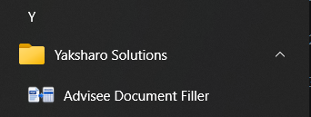</td></tr>
<tr><td>

**2. Step 1 - PDF Files**

The wizard opens here. Enter the Adviser and Dean name (both required -
printed on the signature lines of both documents and remembered for next
time).

</td><td>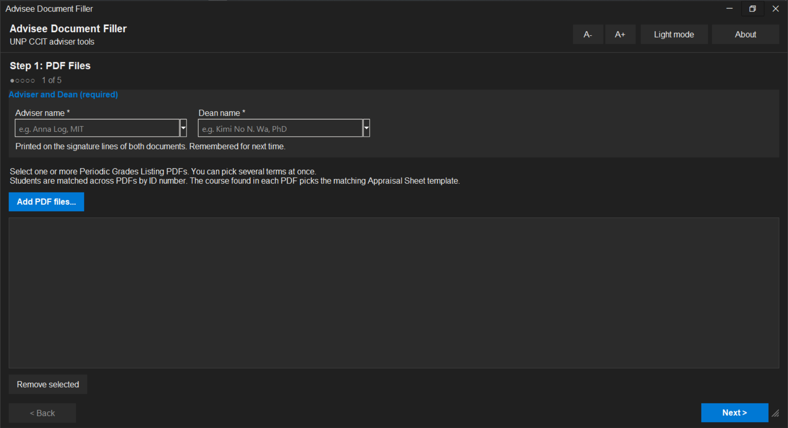</td></tr>
<tr><td>

**3. Add the grade listing PDFs**

Click "Add PDF files..." and pick one or more Periodic Grades Listing
PDFs from the student portal - 1st and 2nd term (and beyond) can be added
together in one go.

</td><td>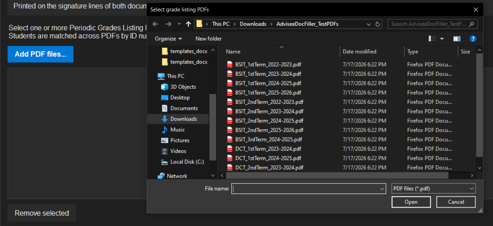</td></tr>
<tr><td>

**4. Ready to parse**

With the names filled in and the PDFs listed, click "Next >". Select a
file and click "Remove selected" if you added the wrong one.

</td><td>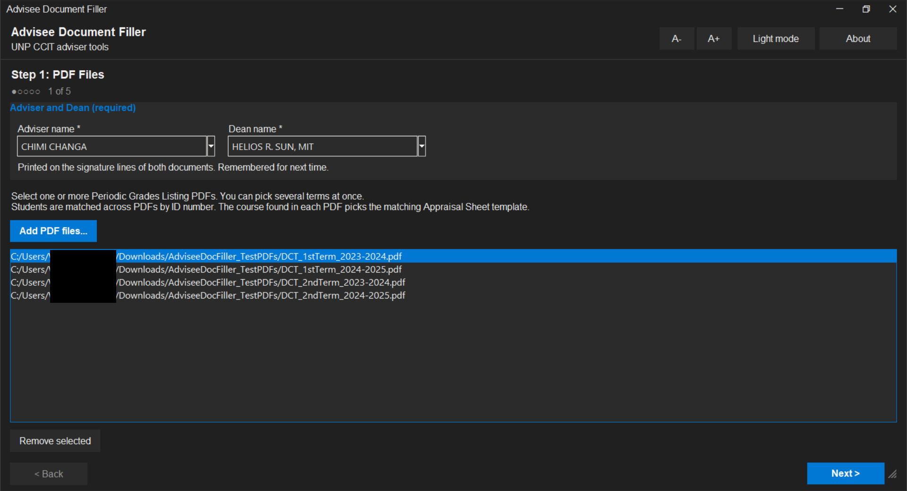</td></tr>
<tr><td>

**5. Parsing**

The PDFs are read on a background thread, so the window stays responsive
while it works.

</td><td>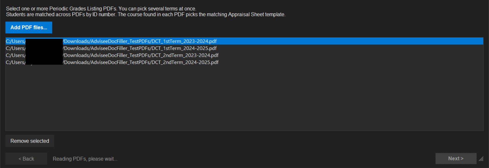</td></tr>
<tr><td>

**6. Step 2 - Students**

Every student found across the PDFs, matched by ID number. Untick anyone
you want to skip, or use Select all / Select none.

</td><td>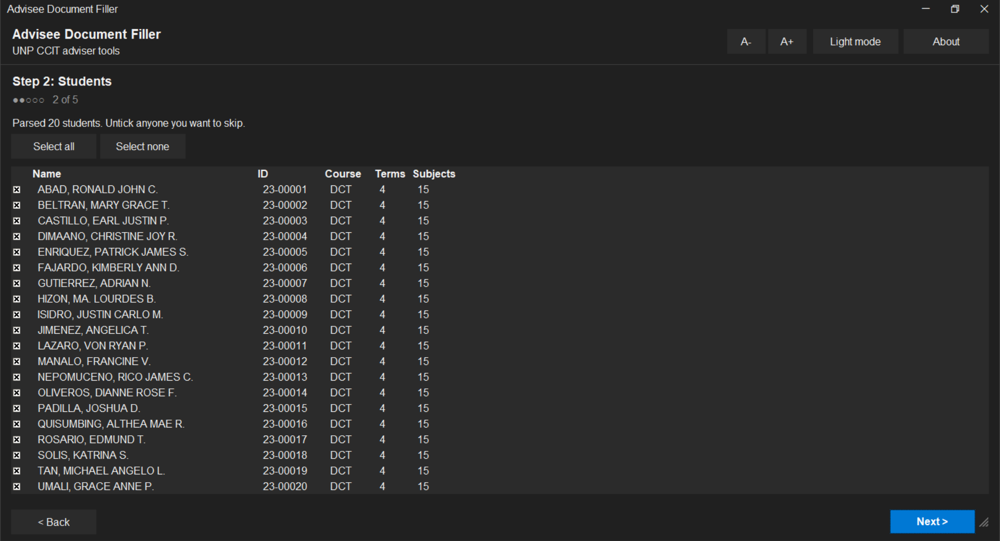</td></tr>
<tr><td>

**7. Step 3 - Documents**

Choose which documents to generate, which terms to include on the Report
of Rating, and the output format (individual files vs. one merged batch
file for bulk printing).

</td><td>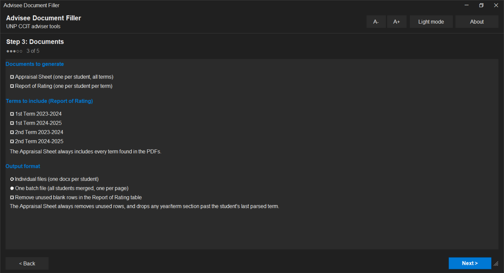</td></tr>
<tr><td>

**8. Step 4 - Faculty**

Every subject code found in the PDFs, with a Faculty name field for each.
Pick a name you've used before or type a new one; leaving one blank
leaves that column blank in the generated documents.

</td><td>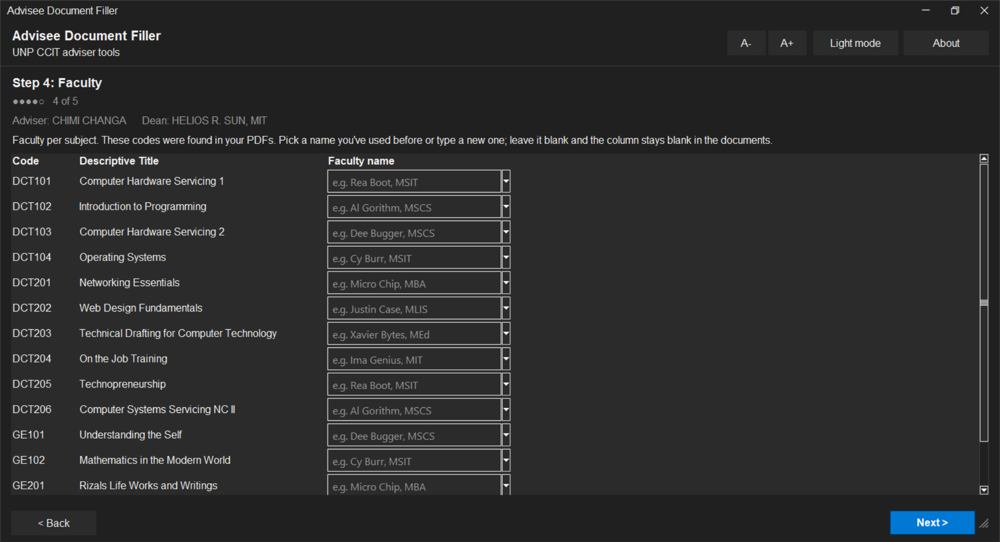</td></tr>
<tr><td>

**9. Step 5 - Review and generate**

Double-check the summary, set (or Browse to) the output folder, and click
"Generate documents".

</td><td>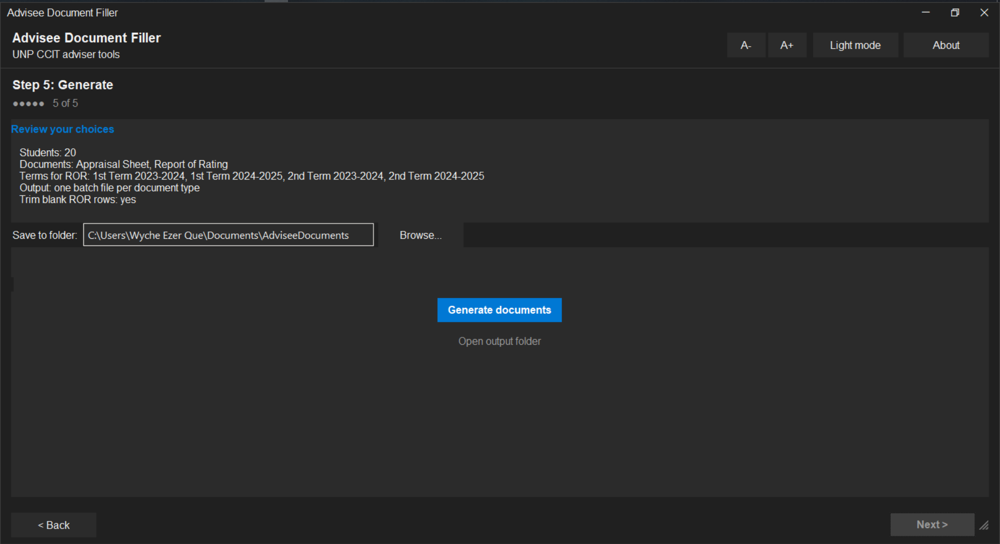</td></tr>
<tr><td>

**10. Generating**

A progress bar tracks each document as it's written.

</td><td>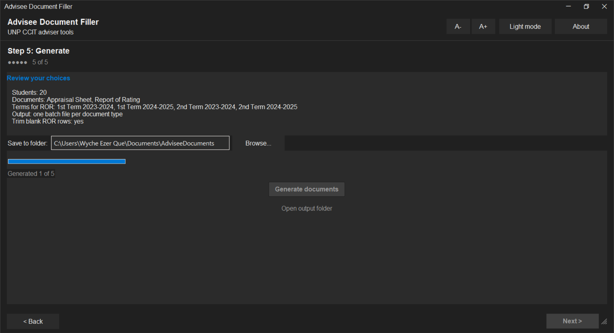</td></tr>
<tr><td>

**11. Done**

Click "Open output folder" to jump straight to the generated `.docx`
files.

</td><td>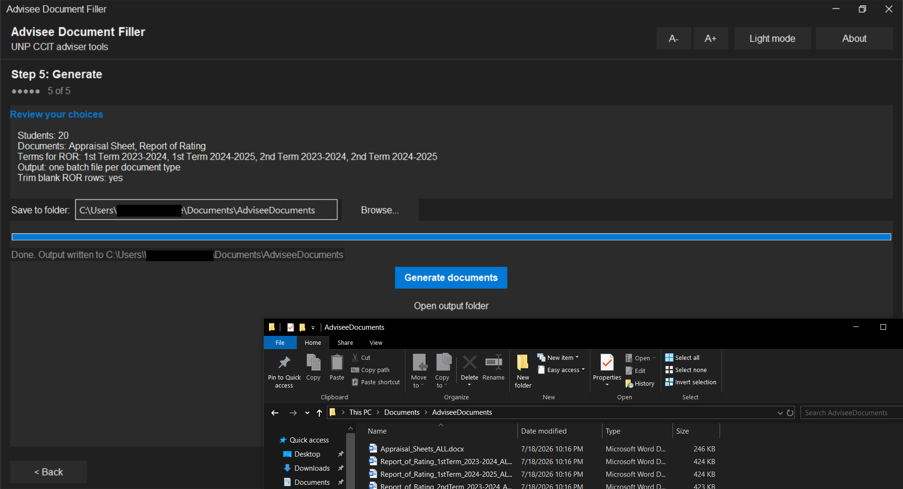</td></tr>
</table>

### Remembering names (local database)

The app keeps a small local SQLite database (`store.db`, in the OS's
standard per-user app-data folder - never bundled, never synced) of every
Adviser, Dean and per-subject-code faculty name you've typed. Next time,
those show up as suggestions: a dropdown you can pick from on the desktop
app, or autocomplete on the web app, and the faculty step pre-fills any
subject code it recognizes from a previous run. You can still type a new
name at any time - nothing is required to already be in the list. Nothing
in this database ever leaves the machine.

### How the data maps

- The periodic rating column in the PDF goes to the Midterm cell of the
  Report of Rating. The Grade column goes to the Final cell.
- The course code found in the PDF (`BSCS`, `BSIT`, `BLIS` or `DCT`) picks
  the Appraisal Sheet template. An unrecognized code falls back to the
  BSCS template.
- Each Appraisal Sheet template has one term table per year/term the
  course actually has (DCT: First and Second Year only; the others also
  have Third Year, Mid Year and Fourth Year). Tables are filled in
  chronological order - earliest school year first, 1st Term before 2nd -
  based on the Period line in each PDF, not on any year label in the PDF
  itself.
- Whole year blocks (heading and table) that come after the student's
  last parsed term are removed from the generated file, e.g. a student
  who only reached Second Year won't have Third Year, Mid Year or Fourth
  Year sections at all.
- Term/SY is written as `1st/25-26` style. Change `term_sy_label` in
  `filler.py` if your format differs.
- Total units per term is computed and placed in the totals row.

## Building & Releasing

### Build with GitHub (no local build needed)

Push this project to a GitHub repository. The included workflow at
`.github/workflows/build.yml` builds both executables on GitHub's own
Windows and Linux machines, so you never build on your own computer.

- Manual build: open the repo's Actions tab, pick "Build executables",
  click "Run workflow", wait a few minutes. This publishes/updates a
  rolling "latest" pre-release on the repo's Releases page with every
  build attached, so it's shareable without anyone needing to sign in
  (unlike raw workflow-run artifacts, which are private and expire).
- Release build: create and push a tag like `v1.0`
  (`git tag v1.0 && git push origin v1.0`). GitHub builds both binaries
  and attaches them to a proper versioned Release page instead of the
  rolling "latest" one.

### Verifying a release (Sigstore)

Every release includes `SHA256SUMS` and `SHA256SUMS.bundle`. The bundle
proves the published files were built by this repo's `build.yml` on
GitHub's runners and haven't been altered since, using
[Sigstore](https://www.sigstore.dev/) keyless signing (no private key to
leak, verifiable against the public Rekor transparency log). This is a
supply-chain integrity check, not a Windows/Authenticode signature - it
won't change the SmartScreen or "Unknown Publisher" prompt, which come
from a separate, CA-based trust system.

To verify with [cosign](https://docs.sigstore.dev/cosign/system_config/installation/):

```
cosign verify-blob \
  --bundle SHA256SUMS.bundle \
  --certificate-identity-regexp "^https://github.com/Yaksharo/appraisal-filler/" \
  --certificate-oidc-issuer https://token.actions.githubusercontent.com \
  SHA256SUMS
```

Then confirm your downloaded file's hash appears in `SHA256SUMS`
(`sha256sum -c SHA256SUMS` on Linux, `certutil -hashfile <file> SHA256`
on Windows).

## Platform Details

<details>
<summary>Window style</summary>

- Linux: the app keeps your desktop environment's native titlebar, so
  it automatically matches GNOME, KDE, XFCE, or whatever you run.
- Windows: the app draws its own borderless titlebar that follows the
  light/dark theme, with minimize, maximize/restore, and close buttons,
  drag-to-move, double-click to maximize, and a resize grip at the
  bottom-right.

</details>

<details>
<summary>Themes and accessibility</summary>

- Desktop app: a flat, neutral white/grey/black look with a single blue
  accent, styled to blend in with the default light/dark themes of
  Windows 10/11, GNOME, and KDE. Follows your system light/dark theme on
  startup, with a toggle in the header. A- and A+ buttons resize all text.
- Web app: follows the system theme, with a toggle that remembers your
  choice.

</details>

<details>
<summary>App icon</summary>

The logo in `assets/` is used everywhere automatically:

- Windows: the exe file icon (embedded at build time) and the window
  and taskbar icon at runtime.
- Linux: the window and taskbar icon at runtime. Linux binaries cannot
  embed a file icon, so for a launcher/menu icon copy the binary and
  `assets/logo.png` somewhere permanent (e.g. `/opt/AdviseeDocFiller/`),
  adjust the paths inside `AdviseeDocFiller.desktop`, and copy that file
  to `~/.local/share/applications/`.
- Web app: the same logo is served as the favicon.

</details>

## Notes

- The templates live in `templates_docx/`. Replace them with updated forms
  as long as the table layout stays the same; add a new course by dropping
  in a docx and adding it to `APPRAISAL_TEMPLATES` in `filler.py`.
- Unused blank rows are removed automatically in both documents: on the
  Report of Rating you can untick the option in the UI to keep them, the
  Appraisal Sheet always trims them (that's what the extra blank rows in
  the BSCS/BSIT/BLIS templates are for).
- Trailing empty paragraphs in the templates are stripped, so the Report
  of Rating no longer produces a blank second page.
- The parser targets the exact layout of the "Periodic Grades Listing"
  report. If the registrar changes the report layout, adjust `parser.py`.
- The About section (desktop) and footer (web) show the version of the
  build you're running, resolved from `VERSION` (bundled by the build
  workflow from the git tag) and falling back to `git describe` when
  running from source. See `version.py`.

## License

[MIT](LICENSE)

## Author

Developed by **Yaksharo** a.k.a. Ezer
